# AUDITORIA — Promo Finance V2

> Varredura executada em 2026-09-24, HEAD `81c4576`, branch `claude/gifted-einstein-ps0mmh`.
> Somente leitura. 6 frentes paralelas com evidência real (código, queries no banco de produção
> `bwwbeyolnnzppeuhgkcd`, comandos de shell). PII mascarada em toda evidência.

## 1. Estado geral

Sistema financeiro corporativo multi-empresa (contas a pagar/receber, conciliação, tributário,
NF-e/SEFAZ, cobrança, IA) — Vite/React/TS + Supabase Cloud (Postgres/RLS/Edge Functions) + N8N/Bitrix24/Asaas/Bling/SEFAZ.
599 migrations, 107 edge functions, 76+ páginas. RLS geral está sólido (0 tabela sem RLS, 0 policy
INSERT sem `WITH CHECK`, 0 `SECURITY DEFINER` sem `search_path`) — o hardening de RLS documentado no
CLAUDE.md funcionou. Os problemas reais estão em outra camada: **autorização por tenant dentro das
Edge Functions** (que rodam com `service_role` e ignoram RLS) e **drift entre o que o frontend espera
e o que o banco de produção realmente tem**.

**5 maiores riscos:**
1. **[P0]** IDOR em `asaas-proxy` — qualquer usuário financeiro/admin de qualquer empresa pode fazer PIX cash-out, cancelar/estornar cobranças de outras empresas.
2. **[P0]** IDOR em `sefaz-manifestar` — qualquer usuário autenticado pode manifestar NFe de outra empresa, assinando com o certificado digital dela junto à SEFAZ.
3. **[P0]** `service_role` JWT de um projeto Supabase de terceiro (`xyykivpcdbfukaongpbw`) ficou commitado no histórico git — ainda extraível, válida até 2036.
4. **[P1]** 2 migrations commitadas nunca foram aplicadas em produção — 4 RPCs financeiras/tributárias que o frontend já chama (aprovação de pagamento, DARF, NF-e com créditos) não existem no banco; alertas críticos (push, WhatsApp IA) nunca disparam.
5. **[P1]** Emissão de boleto via Asaas está quebrada (INSERT em colunas que não existem em `boletos`), e a fila de cobrança marca envio como sucesso mesmo quando falha — cobrança pode nunca sair e ninguém percebe.

---

## 2. Mapa de conexões

```mermaid
graph TD
  UI_Fin["UI Financeiro<br/>ContasPagar, ContasReceber, FluxoCaixa, Conciliacao,<br/>Boletos, Tesouraria, PixHub, Movimentacoes, Compras, Orcamentos"]
  UI_Trib["UI Tributário<br/>51 páginas em src/pages/tributario/*<br/>(SimulacaoRegimes, SplitPayment, SpedExport, PerDcomp, ...)"]
  UI_NFe["UI NF-e/SEFAZ<br/>NotasFiscais, tributario/NfeRecebidas,<br/>CertificadosDigitais, SefazObservabilidade, ImportacaoXML"]
  UI_Cob["UI Cobrança<br/>Cobrancas, Boletos, PagamentosRecorrentes, Asaas"]
  UI_IA["UI IA<br/>Expert, admin/InsightsIA, admin/AuditoriaIA,<br/>admin/AnomaliaDetalhe, InteligenciaOperacional"]
  UI_Admin["UI Admin/SSO<br/>Usuarios, Seguranca, admin/SREComandCenter, admin/SSOAdmin,<br/>admin/ScimAudit, Integracoes, AuditLogs, Bitrix24"]

  UI_Fin -->|invoke| EF_Asaas[asaas-proxy]
  UI_Fin -->|invoke| EF_OF[open-finance]
  UI_Cob -->|invoke| EF_Regua["executar-regua-cobranca<br/>processar-fila-cobrancas"]
  UI_NFe -->|invoke| EF_Sefaz["sefaz-dfe-puxar / sefaz-dfe-dispatcher<br/>sefaz-manifestar / nfe-upload-certificado"]
  UI_Trib -->|invoke| EF_Trib["calculo-iva, simular-presumido/real/simples,<br/>decidir-regime, gerar-dre-tributaria,<br/>gerar-sped-ecd/ecf, executar-fechamento-tributario"]
  UI_IA -->|invoke| EF_IA["expert-agent, copilot-global,<br/>detectar-anomalias-financeiras, analise-fluxo-ia,<br/>analise-preditiva, whatsapp-ia-proativo"]
  UI_Admin -->|invoke| EF_Integr["bitrix24-sync, scim-server,<br/>sso-callback, sso-initiate,<br/>convidar-contador, aceitar-convite"]
  UI_Fin -->|invoke| EF_Bling[bling-proxy]

  EF_Asaas --> DB_Asaas[("asaas_payments, asaas_customers,<br/>asaas_transfers, asaas_audit_trail,<br/>asaas_sync_queue, contas_receber")]
  EF_Asaas -->|REST + ASAAS_API_KEY| SVC_Asaas[["Asaas"]]

  EF_OF --> DB_OF[("contas_bancarias, transacoes_bancarias,<br/>open_finance_consents")]
  EF_OF -->|OAuth/REST| SVC_OF[["Open Finance"]]

  EF_Regua --> DB_Reg[("contas_receber, regua_cobranca,<br/>execucoes_regua_cobranca, fila_cobrancas,<br/>execucoes_cobranca")]
  EF_Regua -->|API| SVC_WA[["WhatsApp / Evolution"]]

  EF_Sefaz --> DB_Sefaz[("empresas_certificados, sefaz_dfe_cursor,<br/>nfe_eventos, nfe_recebidas, cron_job_logs")]
  EF_Sefaz -->|SOAP/REST + NFE_CERT_MASTER_KEY| SVC_Sefaz[["SEFAZ"]]
  EF_Sefaz -.->|cnpja-lookup, sefaz-manifestar| SVC_CNPJA[["CNPJA"]]

  EF_Trib --> DB_Trib[("apuracoes_tributarias, creditos_tributarios,<br/>alertas_tributarios, elisao_tarefas_acionaveis")]

  EF_IA --> DB_IA[("acoes_recomendadas, alertas,<br/>health_scores_operacionais,<br/>contas_pagar, contas_receber")]
  EF_IA -->|OPENAI_API_KEY| SVC_OpenAI[["OpenAI"]]

  EF_Integr --> DB_Bitrix[("bitrix_oauth_tokens, bitrix_sync_logs,<br/>bitrix_field_mappings, clientes, empresas")]
  EF_Integr -->|REST| SVC_Bitrix[["Bitrix24"]]

  EF_Bling --> DB_Bling[("bling_tokens")]
  EF_Bling -->|REST OAuth| SVC_Bling[["Bling ERP"]]

  WH["Webhooks públicos:<br/>asaas-webhook, bling-webhook,<br/>bitrix24-webhook, whatsapp-webhook"] --> DB_Asaas
  WH --> SVC_Bling
  WH --> SVC_Bitrix
  WH --> SVC_WA

  Cron["pg_cron (23 migrations com cron.schedule):<br/>executar-regua-cobranca-diaria (0 12 * * *)<br/>gerar-alertas-vencimento-diario (0 8 * * *)<br/>gerar-contas-recorrentes-diario (35 3 * * *)<br/>processar-regua-cobranca-diario (0 9 * * *)<br/>enviar-digest-conformidade-horario (30 * * * *)<br/>cron-failure-watch, daily-log-retention,<br/>pgss_weekly_baseline"] --> EF_Regua
  Cron --> EF_Trib
  Cron -.-> EF_IA

  N8N["n8n-dispatch / n8n-callback"] -->|N8N_DISPATCH_SECRET| SVC_N8N[["N8N"]]
  N8N -.-> EF_Integr

  ExtDB["compare-schemas / external-data<br/>(EXTERNAL_SUPABASE_URL, SCHEMA_COMPARE_EXTERNAL_URL)"] -.->|não é este projeto| SVC_ExtDB[["Banco externo<br/>(self-hosted/staging)"]]
```

Dependências centrais confirmadas via `bun.lock`: react 18.3.1, vite 8.2.2, typescript 5.8.3,
`@tanstack/react-query` 5.90.21, `@supabase/supabase-js` **2.87.1** no frontend vs **2.49.4** pinado
em 18 edge functions (ver A-039), jspdf 4.2.1, xlsx 0.20.3 (via CDN sheetjs), node-forge 1.3.1 (certificado NF-e).

---

## 3. Achados

### Banco de dados

#### A-001 · [P1] · banco — 2 migrations commitadas nunca foram aplicadas em produção: 4 RPCs financeiras/tributárias que o frontend chama não existem
Evidência: `supabase_db_migrations` → max(version) aplicada = `20260912100000`. Os arquivos locais
`supabase/migrations/20260913120000_corrige_credenciais_automacoes_internas.sql` e
`supabase/migrations/20260913140000_rpcs_atomicas_fluxos_multi_passo.sql` são posteriores e não
constam em `supabase_migrations.schema_migrations`. Query direta em `pg_proc` confirmou 0 linhas para
`aprovar_solicitacao_pagamento`, `gerar_darf_retencoes`, `pagar_darf_retencoes`,
`registrar_nfe_com_creditos`. Frontend chama essas RPCs: `src/hooks/expert-actions/financial-actions.ts:97`,
`src/hooks/useAprovacoes.ts:310`, `src/hooks/useRetencoesFonte.ts:219,256`, `src/hooks/useImportacaoXMLNFe.ts:294`.
Impacto: aprovação de solicitação de pagamento, geração/pagamento de DARF de retenções na fonte, e
importação de XML de NF-e com créditos falham com "function not found" (PGRST202) — 3 fluxos
financeiros/tributários centrais quebrados desde a publicação do frontend.
Causa raiz: migration commitada no repositório mas nunca executada contra o projeto Supabase Cloud.

#### A-002 · [P1] · banco — Triggers de notificação crítica (push e WhatsApp IA) não existem no banco
Evidência: query em `pg_trigger` para `trg_notificar_alerta_critico_push` (deveria disparar em INSERT
em `public.alertas`) e `on_whatsapp_message_inserted` (INSERT em `public.historico_cobranca_whatsapp`)
retornou 0 linhas. `supabase_db_list_triggers` confirma que `alertas` só tem `trg_alertas_set_empresa`
(BEFORE INSERT) e que `historico_cobranca_whatsapp` não tem nenhum trigger. Ambos vêm da mesma
migration não aplicada (A-001); o próprio comentário da migration documenta que essas rotinas
"nunca funcionaram desde 2026-04-18/2026-05-09".
Impacto: alertas de prioridade crítica nunca geram push notification; mensagens WhatsApp nunca
disparam análise por IA — falha silenciosa contínua.
Causa raiz: mesma migration não aplicada de A-001.

#### A-003 · [P2] · banco — `notify_performance_alert_trigger` continua com credencial incorreta na versão viva
Evidência: o trigger `performance_alerts_notify_trigger` existe e usa a versão de
`20260905130000` (aplicada), não a versão corrigida de `20260913120000` (não aplicada). Comentário
da migration não aplicada: `20260905130000` corrigiu URL/projeto da chave mas "o TIPO da credencial
continuou errado" (envia `Authorization: Bearer <anon key>` para função com `verify_jwt=false`, que o
guard interno rejeita com 401 assíncrono e silencioso).
Impacto: alertas `critical`/`warning` de performance continuam não notificados via `notify-performance-alert`.
Causa raiz: mesma migration não aplicada de A-001.

#### A-004 · [P2] · banco — Gap de rastreamento entre 599 migrations locais e 357 linhas em `schema_migrations`
Evidência: `ls supabase/migrations | wc -l` = 599. `supabase_migrations.schema_migrations` tem 357
linhas, min(version)=20260518153051, max(version)=20260912100000. ~401 arquivos locais caem no
intervalo coberto pela tabela de tracking contra só 357 linhas rastreadas — diferença de ~44 não
reconciliada 1:1 neste escopo (pode ser squash via migrations `reconciliar_schema_*`, ou gaps reais).
Impacto: o caso A-001/A-002 prova que arquivos podem ficar "esquecidos" sem nenhum alerta — o
processo de deploy de migrations não é confiável.
Causa raiz: não determinada a fundo (ver Não verificado).

#### A-005 · [P3] · banco — Policy RLS morta em `integration_secrets`
Evidência: `admin_only_integration_secrets` (PERMISSIVE, role=admin via `user_roles`) nunca é
alcançada porque `integration_secrets_no_client_access` (RESTRICTIVE, `using(false)`) já bloqueia
incondicionalmente o role `authenticated` (que é o role de conexão de qualquer usuário logado,
admin incluso). Resultado de segurança está correto (só `service_role` acessa), mas é código morto.
Impacto: nenhum funcional; risco de confusão para quem futuramente mexer na RESTRICTIVE achando que
ela quebra o acesso do admin.
Causa raiz: duas policies redundantes escritas em migrations diferentes sem revisão conjunta.

#### A-006 · [P3] · banco — 24 pares de índices duplicados
Evidência: `supabase_db_duplicate_indexes` retornou 24 pares — destaque `uq_index_usage_snapshots_snapshot_schema_index`/`index_usage_snapshots_unico` (2160 kB), `bloat_snapshots_snapshot_date_table_name_key`/`idx_bloat_snapshots_date_table` (1200 kB), `performance_alerts_source_alert_key_alert_hour_key`/`idx_perf_alerts_source_key` (656 kB), mais pares em `aliquotas_interestaduais`, `ncms`, `ufs`, `cnaes`, `faixas_simples_nacional`, `fechamentos_tributarios`, `conformidade_snapshots`, `entregas_obrigacoes`, `user_active_filters`, `webhooks_log`, `regras_roteamento_financeiro`, `relatorios_tributarios_agendados`, `protocolos_st_ncms/ufs`, `custom_oauth_providers`, `nfe_recebidas`.
Impacto: ~4.3MB de overhead de disco/escrita duplicado nos 3 maiores pares, sem ganho de performance.
Causa raiz: índices UNIQUE criados por constraint e por `CREATE INDEX` manual cobrindo as mesmas colunas em migrations diferentes.

#### A-007 · [P3] · banco — Tabelas financeiras sem autovacuum, dead tuples proporcionalmente altos
Evidência: `supabase_db_table_bloat` — `fornecedores` (90.9% dead, last_autovacuum=null),
`centros_custo` (85.7%), `contas_bancarias` (84.6%), `conciliacoes` (75%), `lancamentos_contabeis`
(56.3%), `solicitacoes_aprovacao` (77.8%).
Impacto: irrelevante hoje (dezenas de linhas), mas indica que autovacuum nunca disparou — se o
volume crescer sem ajuste de `autovacuum_vacuum_scale_factor`, o bloat proporcional vira real.
Causa raiz: threshold padrão de autovacuum não ajustado para tabelas pequenas/alta taxa de update.

#### A-008 · [P3] · banco — Modelo de tenant inconsistente entre `clientes` e `fornecedores`
Evidência: `fornecedores` não tem coluna `empresa_id`; suas 4 policies RLS são todas por
`user_id = auth.uid()`. `clientes` tem policies por `user_id` E por `empresa_membro_ativo(empresa_id)`,
dando acesso compartilhado dentro da mesma empresa.
Impacto: um fornecedor cadastrado por um usuário não é visível/editável por outro usuário da mesma
empresa (mesmo sendo financeiro/admin) — bug funcional de colaboração (não é vazamento entre empresas).
Causa raiz: `fornecedores` não recebeu o mesmo hardening multi-tenant que `clientes`.

### Backend / Edge Functions e fluxos críticos

#### A-009 · [P0] · backend — IDOR cross-tenant em `asaas-proxy`: qualquer financeiro/admin move dinheiro e mexe em cobranças de outras empresas
Evidência: `supabase/functions/asaas-proxy/index.ts:76-90` só checa role global (`admin`/`financeiro`
em `user_roles`, sem `empresa_id`). Quase nenhuma action valida vínculo `user_empresas` com o recurso:
`criar_cliente`(133-167)/`criar_cobranca`(217-322) inserem `empresa_id` arbitrário do body;
`cancelar_cobranca`(330-337), `estornar_cobranca`(340-355), `segunda_via_boleto`(358-377),
`pix_qrcode`, `consultar_cobranca` operam só por `asaas_id`; `transferir_pix`(436-489) faz **PIX
cash-out real** para `chave_pix`/`valor` arbitrários só exigindo a role global. Única action corrigida:
`analisar_risco_cliente`(801-812), com comentário reconhecendo o padrão IDOR.
Impacto: usuário "financeiro" de uma empresa consegue cancelar/estornar cobranças, criar clientes
fantasmas e **sacar via PIX** fundos da conta Asaas compartilhada, sem vínculo com a empresa afetada.
Como explorar: autenticar como `financeiro`/`admin` (qualquer empresa) e chamar `asaas-proxy` com
`action: "transferir_pix"` (chave_pix/valor arbitrários) ou `cancelar_cobranca`/`estornar_cobranca`
com `asaas_id` de outra empresa.
Causa raiz: autorização só por role global, sem reaproveitar `exigirVinculoEmpresa` (já existe em
`_shared/auth-guard.ts` e é usado corretamente em outras functions do mesmo repo).

#### A-010 · [P0] · backend — `sefaz-manifestar` permite manifestar NFe de qualquer empresa, assinando com o certificado digital dela
Evidência: `supabase/functions/sefaz-manifestar/index.ts:222-264` só exige sessão válida — sem
consulta a `user_empresas`/`user_roles`. `executeManifestacao`(106-220) localiza a NFe só pelo
`chave_acesso` do body(122-127), carrega o certificado A1 do CNPJ destinatário(130-138) e assina/envia
o evento à SEFAZ(154-193) sem checar se o chamador pertence à `empresa_id` da NFe.
Impacto: qualquer usuário autenticado pode registrar "Ciência da Operação"/"Confirmação"/
"Desconhecimento"/"Operação não Realizada" em nome de outra empresa do grupo, usando o certificado
digital dela — ação enviada à SEFAZ e, na prática, irreversível.
Como explorar: autenticar com qualquer usuário válido e chamar `sefaz-manifestar` com `chave_acesso`
de NFe de empresa diferente da do chamador.
Causa raiz: ausência do padrão `exigirVinculoEmpresa` já usado em `nfe-upload-certificado`.

#### A-011 · [P1] · backend — `conciliacao-ia` sem autenticação e sem rate limit
Evidência: `supabase/functions/conciliacao-ia/index.ts` — zero import de `auth-guard.ts`/
`exigirUsuario` e zero `checkRateLimit` no arquivo inteiro; handler(89) só faz `req.json()` →
`validateContract` → chama `ai.gateway.lovable.dev` com `LOVABLE_API_KEY`(151). Function irmã
`categorizar-despesa` tem `exigirUsuario`(34) e rate limit de 30 req/min(38-51).
Impacto: requisição anônima gera chamadas pagas ao AI gateway sem limite — drena créditos, pode
causar DoS por esgotamento de cota.
Como explorar: `POST` direto ao endpoint público sem header Authorization, repetidamente.
Causa raiz: guard de autenticação e rate limit não aplicados nesta function.

#### A-012 · [P1] · backend — `bling-proxy` sem RBAC: qualquer usuário autenticado pode excluir produtos, cancelar NF-e, baixar/estornar contas
Evidência: `supabase/functions/bling-proxy/index.ts:14-37` só verifica sessão válida — nenhuma
consulta a `user_roles` no arquivo inteiro. O `switch`(57-290) expõe `excluir_produtos`,
`excluir_contas_pagar/receber`, `cancelar_nfe`, `estornar_contas_nfe`, `baixa_conta_pagar`,
`excluir_bordero`, sem restrição de role (`asaas-proxy` ao menos exige `admin`/`financeiro`).
Impacto: qualquer conta logada (ex.: role `visualizador`) pode cancelar notas fiscais, excluir
produtos/contas e manipular o financeiro integrado ao Bling.
Como explorar: autenticar com qualquer usuário válido e chamar `action: "cancelar_nfe"` ou
`"excluir_conta_pagar"`.
Causa raiz: guard de RBAC não implementado; só há verificação de autenticação.

#### A-013 · [P1] · fluxo-crítico — `processar-fila-cobrancas` marca envio como sucesso mesmo quando falha (erro engolido)
Evidência: `supabase/functions/processar-fila-cobrancas/index.ts:62-83` — para canais `email`/
`whatsapp`, faz `await supabase.functions.invoke(...)` e em seguida `success = true`
**incondicionalmente**, sem checar o `error` que `functions.invoke` devolve (a API não lança
exceção em erro HTTP). Contraste: `executar-regua-cobranca/index.ts:119-137` propaga corretamente
`error?.message`.
Impacto: se `enviar-alerta-email`/`whatsapp-ia-proativo` falhar, o item é gravado como `enviado` e
removido da fila — a cobrança real nunca chega ao cliente e ninguém percebe.
Causa raiz: falta checagem do campo `error` retornado por `supabase.functions.invoke`.

#### A-014 · [P1] · fluxo-crítico — `executar-fechamento-tributario` não filtra por `empresa_id` no check de conciliação bancária
Evidência: `supabase/functions/executar-fechamento-tributario/index.ts:160-165` conta
`transacoes_bancarias` pendentes por período sem `.eq('empresa_id', body.empresa_id)` — diferente
das outras 5 checagens da mesma function, que filtram corretamente.
Impacto: o checklist "Conciliação bancária do período" do fechamento da Empresa A conta transações
pendentes de TODAS as empresas — pode bloquear indevidamente o fechamento de A por pendência de B,
ou mascarar pendência real de A. Resultado tributário/contábil incorreto num gate que decide se o
mês pode ser fechado.
Causa raiz: filtro de tenant esquecido nesta query específica.

#### A-015 · [P1] · backend — `open-finance` (`import_transactions`) escreve em `transacoes_bancarias` de qualquer conta sem checar posse
Evidência: `supabase/functions/open-finance/index.ts:451-520` recebe `contaBancariaId` do body e,
com client `service_role` (sem RLS), faz select/insert em `transacoes_bancarias`/`contas_bancarias`
filtrando só por `id`, nunca validando que a conta pertence a empresa do usuário (só valida sessão
válida, 56-68).
Impacto: qualquer usuário autenticado pode injetar transações bancárias fabricadas na conta de outra
empresa (bastando conhecer/adivinhar o UUID). Fonte hoje é mock (sem integração bancária real), mas
a falha de isolamento será herdada quando a integração real for ligada.
Causa raiz: ausência de `exigirVinculoEmpresa` antes do insert.

#### A-016 · [P2] · backend — `gerar-pacote-evidencias` exporta dado financeiro/tributário/conformidade de qualquer empresa para role "admin" global
Evidência: `supabase/functions/gerar-pacote-evidencias/index.ts:257-278` exige só
`user_roles.role = 'admin'` (tabela sem `empresa_id`). Body aceita `empresa_id` livre(14); queries
(144-151) usam esse valor direto com `service_role`, sem validar posse. Comentário do próprio código
(31-32) já reconhece o problema.
Impacto: qualquer conta "admin" (mesmo vinculada só à empresa A) pode gerar/baixar (signed URL 7
dias) o pacote de evidências financeiras/tributárias/de conformidade de qualquer empresa B.
Como explorar: com conta `admin`, chamar `POST gerar-pacote-evidencias` com `empresa_id` de outra
empresa e baixar o ZIP.
Causa raiz: RBAC global (`user_roles` sem `empresa_id`) usado onde a function assume escopo por
empresa; pode ser intencional (admin de plataforma) mas não está documentado como exceção.

#### A-017 · [P2] · integracoes — Fetch a Asaas/Bling sem timeout explícito
Evidência: `asaas-proxy/index.ts:14-41` (`asaasFetch`) e `bling-proxy/index.ts:505-556`
(`blingFetch`) usam retry+circuit breaker mas o `fetch()` não recebe `signal`/`AbortSignal.timeout`.
`_shared/resilience.ts:120-138` define `withTimeout()` mas não tem nenhum chamador (`grep -rl` = 0)
— função morta. Contraste: `sefaz-dfe-puxar`, `sefaz-manifestar`, `n8n-dispatch` usam
`AbortSignal.timeout`/`AbortController` corretamente.
Impacto: chamada pendurada ao Asaas/Bling pode segurar a invocação até o timeout implícito da
plataforma, em vez de falhar rápido e liberar retry/circuit breaker.
Causa raiz: utilitário `withTimeout` escrito mas nunca conectado aos dois proxies financeiros mais usados.

#### A-018 · [P2] · integracoes — `processar-fila-cobrancas` não usa a RPC atômica (`FOR UPDATE SKIP LOCKED`) que já existe no banco
Evidência: `processar-fila-cobrancas/index.ts:41-45` faz `SELECT ... WHERE status='pendente' LIMIT
20` seguido de `UPDATE` por item, sem `FOR UPDATE SKIP LOCKED`. `supabase/migrations/20260317001356_*.sql:161-168`
já define `public.processar_fila_cobrancas(p_limite)` com claim atômico exatamente para evitar essa
corrida — a edge function não a chama.
Impacto: duas invocações concorrentes (duplo clique, retry de rede, execução simultânea via UI +
automação) podem selecionar as mesmas linhas antes do primeiro UPDATE fechar a corrida — cobrança
(email/WhatsApp) enviada duas vezes ao mesmo cliente. Requer usuário com papel admin/financeiro.
Como explorar: usuário financeiro aciona "processar fila" em duas abas quase simultaneamente.
Causa raiz: RPC segura criada em migration mas a edge function nunca foi atualizada para usá-la.

#### A-019 · [P2] · seguranca — `asaas-webhook`/`n8n-dispatch` usam comparação de token não constante-time
Evidência: `asaas-webhook/index.ts:26` (`receivedToken !== WEBHOOK_TOKEN`) e
`n8n-dispatch/index.ts:82` (`x-n8n-secret !== expected`) comparam string direta, ao contrário do
padrão `segredosIguais`/`timingSafeEqual` usado em `_shared/auth-guard.ts`, `_shared/webhook-auth.ts`
e `mcp-query/index.ts`.
Impacto: side-channel de timing teórico contra o segredo; pouco explorável via rede (jitter), mas
inconsistência de padrão de segurança dentro do mesmo projeto.
Causa raiz: essas duas functions não reusaram o helper compartilhado de comparação segura.

#### A-020 · [P3] · backend — `calculo-iva` sem qualquer autenticação
Evidência: `supabase/functions/calculo-iva/index.ts` inteiro sem guard de auth.
Impacto: baixo — cálculo puro, não toca banco, não chama serviço pago.
Causa raiz: guard de autenticação ausente, mas sem dado sensível nem custo externo em jogo.

### Frontend

#### A-021 · [P1] · frontend — Erro ao criar/editar Conta a Pagar não aparece para o usuário
Evidência: `src/hooks/financial/useContasPagar.ts:132-136` (`useCreateContaPagar.onError`) e
`:153-157` (`useUpdateContaPagar.onError`) fazem só `logger.error(...)` + `sounds.error()`;
`logger.error` é apenas `console.error` (`src/lib/logger.ts:28-32`), sem toast. Contraste:
`useDeleteContaPagar`(172-176) chama `toast.error(...)`, assim como `ContaReceberForm.tsx:178-186,219-226`.
Impacto: se o insert/update em `contas_pagar` falhar (RLS, rede, validação), o diálogo para de mostrar
"Salvando..." sem nenhuma mensagem visível. Com som desligado (comum em escritório), zero feedback —
usuário pode achar que salvou e sair da tela, perdendo o lançamento.
Causa raiz: padrão `onError → toast.error` usado em praticamente todos os outros hooks financeiros,
mas esquecido especificamente nas mutations de criar/editar conta a pagar.

#### A-022 · [P1] · frontend — Movimentações: tabela sem paginação nem virtualização, até 500 linhas renderizadas de uma vez
Evidência: `src/hooks/useFinancialOperations.ts:41-64` (`useMovimentacoes`) usa `.limit(500)` sem
paginação; `src/pages/Movimentacoes.tsx:141-190` renderiza `filtered.map(...)` direto em `<Table>`,
sem `react-window`/paginação (diferente de `ContasPagarList`, que usa `FixedSizeList`).
Impacto: com intervalo de datas amplo, a tabela pode renderizar até 500 linhas de DOM de uma vez —
degradação de performance numa tela financeira central.
Causa raiz: página não reaproveitou o padrão de paginação/virtualização já existente em Contas a Pagar.

#### A-023 · [P2] · frontend — Formatação de moeda duplicada fora de `formatCurrency`, sem guarda contra `undefined`
Evidência: `src/lib/formatters.ts:22-28` já trata `null`/`undefined`/`NaN`. Vários módulos tributários
redefinem localmente sem guarda: `IrpjCsllLucroReal.tsx:27`, `FolhaEncargos.tsx:18`,
`PisCofinsCreditos.tsx:26`, `Monofasico.tsx:30`, `ObservabilidadeDigest.tsx:52` — todos
`v.toLocaleString('pt-BR', {...})` direto.
Impacto: se `v` vier `undefined`/`null` (comum em dados agregados de view ainda não populada),
`v.toLocaleString(...)` lança `TypeError` em runtime (tela quebra) em vez de "R$ 0,00".
Causa raiz: código duplicado em vez de importar o helper central já existente e testado.

#### A-024 · [P3] · frontend — Botão "Novo Acordo Proativo" sem ação (beco sem saída)
Evidência: `src/pages/Cobrancas.tsx:254-257` — botão sem `onClick`.
Impacto: usuário clica e nada acontece; fluxo equivalente existe via `useAcordosParcelamento.ts` mas
não está ligado nessa tela.
Causa raiz: call-to-action deixado sem handler, provável placeholder esquecido.

#### A-025 · [P3] · frontend — Estado `isDeleting` morto em Contas a Pagar
Evidência: `src/hooks/useContasPagarLogic.ts:49` — `const [isDeleting] = useState(false)`, sem
setter usado; passado para `ConfirmDialog isLoading={logic.isDeleting}` em `ContasPagar.tsx:241`.
Impacto: nenhum funcional — spinner de "excluindo" nunca aparece porque o fluxo real usa toast com
undo e fecha o diálogo antes de excluir. Código morto/confuso.
Causa raiz: resquício de versão anterior do fluxo de delete.

### UX

#### A-026 · [P1] · ux — Bulk "Cancelar" em Contas a Pagar/Receber sem confirmação (assimetria com o delete individual)
Evidência: `ContasPagar.tsx:64-67` (`handleBulkCancel`) e `ContasReceber.tsx:90-93` passam o
`onClick` direto para `BulkActionsBar`; `bulk-actions-bar.tsx:87-96` dispara a ação no primeiro
clique, sem `AlertDialog` — diferente do delete individual (`ContasPagar.tsx:234-243`, `ConfirmDialog`).
Impacto: selecionar N contas e clicar "Cancelar" cancela todas imediatamente, sem a mesma barreira do
delete único — cancelamento em massa de obrigações tem efeito equivalente/maior que um delete.
Causa raiz: `BulkActionsBar` não suporta confirmação por ação; os dois fluxos foram implementados sem
reaproveitar `ConfirmDialog`.

#### A-027 · [P1] · ux — Falha ao carregar Contas a Pagar aparece como "lista vazia", não como erro
Evidência: `useContasPagarPaginated`(`useContasPagar.ts:94-107`) lança o erro sem captura local;
`ContasPagar.tsx:172-186` só passa `isLoading`, nunca `isError`; `List.tsx:58-69` trata só
loading/`length===0`, renderizando "Nenhuma conta a pagar cadastrada" em ambos os casos.
Impacto: se a query falhar (RLS, timeout, rede), a tela mostra a mesma mensagem de zero registros —
usuário não percebe erro e não tem botão de retry. Risco de achar que não há nada vencendo.
Causa raiz: nenhum estado de erro é propagado da query para a UI.

#### A-028 · [P1] · ux — Conciliação bancária: lista principal sem loading state, estado de servidor copiado para `useState` local
Evidência: `useConciliacaoPageState.ts:61-84` busca via `useEffect`→`carregarTransacoesBanco(...)`
para `useState` local, sem expor `isLoading`; ao trocar de conta, `setTransacoes([])` é chamado de
imediato(66). `Conciliacao.tsx:353-359` sempre renderiza "Nenhuma transação encontrada" quando
`length===0`, sem diferenciar carregando de vazio real.
Impacto: ao trocar de conta bancária, a tela pisca para "vazio" mesmo com centenas de transações; se
a query falhar, a tela some sem rastro nem retry.
Causa raiz: estado de servidor replicado em `useState` local via `useEffect` em vez de `useQuery`
(React Query), já usado no resto do app.

#### A-029 · [P1] · ux/frontend — Portal do Cliente: autenticação fake em rota pública, com dados mock apresentados como reais
Evidência: `src/App.tsx:178` — rota `/portal-cliente` pública (esperado, é portal externo).
`PortalCliente.tsx:12-19` — `mockDocuments` hardcoded; `:52-53` — `onClick={() =>
setIsAuthenticated(true)}` sem validar o `token` digitado (nenhuma chamada Supabase/edge function);
`:50` — texto "O token foi enviado para o seu e-mail cadastrado"; `:76-78,93,102` — nome/empresa/KPIs
fixos ("João Silva", R$ 3.900,50 etc.).
Impacto: qualquer texto (inclusive vazio) no campo de token libera acesso à área "autenticada", que
mostra dados fictícios fixos como se fossem reais. Feature publicada mas não funcional, anunciada
como "Portal Premium... com total segurança", engana qualquer cliente real que tente usá-la.
Causa raiz: página parece protótipo nunca conectado a validação real, mas ficou na rota pública de produção.

#### A-030 · [P2] · ux — Conciliação: "Ignorar Transação" (individual e em lote) sem confirmação
Evidência: `Conciliacao.tsx:333-335` (individual) e `:378-381` (lote, `variant: 'destructive'`)
chamam `handleIgnorar`/`handleBulkIgnorar` (`useConciliacaoPage.ts:272-286,313-326`) que fazem
`update({conciliada:true, ...})` direto, sem `AlertDialog`.
Impacto: marcar transações como "conciliadas/ignoradas" sem confirmação, principalmente em lote, pode
zerar a fila de pendências por engano; reversível individualmente ("Estornar"), mas não em lote.
Causa raiz: mesmo padrão de A-026 — ação ligada direto à mutação sem `ConfirmDialog`.

### Integrações e infra

#### A-031 · [P2] · infra — Documentação de deploy conflita: `DEPLOYMENT.md` descreve Vercel como produção; `CLAUDE.md` diz Lovable Cloud
Evidência: `docs/DEPLOYMENT.md:7-45` — "Deploy Vercel (produção)... merge em `main` dispara deploy
automático", variáveis "no painel Vercel". `CLAUDE.md:39` — URL prod `app.promo-finance.com`,
Deploy Lovable Cloud. `docs/AUDITORIA_TECNICA_EXAUSTIVA_2026-09-02*.md` confirmam Lovable Cloud como
produção. `package.json` (`@lovable.dev/cloud-auth-js`, `lovable-tagger`) e `index.html` (og:image
lovable.dev) apontam Lovable. `vercel.json` está totalmente configurado (CSP com
`connect-src ... https://sandbox.asaas.com` — outro sinal de mistura de ambientes).
Impacto: ambiguidade real sobre a fonte de verdade de produção; risco de configurar segredos no
painel errado, ou dois deploys "vivos" divergindo silenciosamente.
Causa raiz: documentação não sincronizada após migração de plataforma (ou Vercel é pipeline legado
não desativado).

#### A-032 · [P2] · infra — Gates de segurança do CI (RLS multi-tenant, privilégios) só rodam se `DATABASE_URL` estiver presente, e o job não falha se ausente
Evidência: `.github/workflows/ci.yml` — steps de RLS/privilégios/retenção condicionados a
`db_url_preflight.outputs.available == 'true'`; sem o secret, só roda um step que registra "gates
inconclusivos" e **não falha o job**. Esses gates executam `supabase/tests/sql/rls_multi_empresa.sql`
(gate anti-vazamento cross-tenant). `docs/AUDITORIA_TECNICA_EXAUSTIVA_2026-09-02_R2_LIVE.md:33`
registra que `DATABASE_URL` "nunca esteve nos secrets do repo" numa run anterior, e por isso esse
gate "nunca executou contra o banco real" enquanto o quality-gate aparecia verde.
Impacto: se o secret ainda estiver ausente, merges para `main`/`develop` passam sem que o gate
anti-vazamento multi-tenant tenha rodado, sem sinalização de falha.
Causa raiz: design "skip silencioso quando falta credencial" em vez de "falhar o job" para um gate crítico.

#### A-033 · [P2] · infra — Observabilidade de erro no frontend é um stub "pronto para Sentry" nunca finalizado
Evidência: `src/lib/error-tracking.ts:1-3` ("Ready for Sentry integration"), `:57-94`
(`sentryTracker` só chama `window.Sentry.*` se existir, senão cai em `console.error`), `:128-133`
(`initSentry` só loga em DEV). `package.json` não tem `@sentry/*`; `index.html` não carrega script Sentry.
Impacto: qualquer exceção capturada no frontend em produção vai só para o console do navegador do
usuário — sem canal centralizado de observação de erro de cliente.
Causa raiz: integração planejada mas nunca finalizada (sem DSN/chave provisionada).

#### A-034 · [P2] · infra — Backup/restore de produção: única evidência é uma linha de doc não testável
Evidência: `docs/SECURITY.md:20` — "Backups diários", sem link/script/runbook. `scripts/data/rollback.sh`
só reverte snapshot de uma migration run em **staging** (requer `STAGING_DB_URL`), não é
backup/restore de produção. Nenhum script/runbook de restore de produção no repositório.
Impacto: não há, no repositório, evidência verificável de que um backup de produção já foi restaurado
com sucesso.
Causa raiz: política de backup, se existe, é gerida só pelo Supabase Cloud Dashboard (fora do repo) —
não documentada nem testada aqui.

#### A-035 · [P3] · integracoes — `open-finance` cai em URL sandbox por default silencioso se a env var de produção não estiver setada
Evidência: `open-finance/index.ts:31` — `OPEN_FINANCE_BASE_URL || "https://api.openbanking.org.br/sandbox"`,
sem log de alerta quando cai no default.
Impacto: se o secret de produção não estiver configurado, a função opera contra sandbox sem erro
visível — parece operacional mas não está integrada ao banco real.
Causa raiz: fallback "gracioso" sem alerta.

### Segurança transversal

#### A-036 · [P0] · seguranca — `service_role` JWT de um projeto Supabase de terceiro commitado no histórico git, ainda recuperável
Evidência: `gitleaks git --baseline-path .gitleaks-baseline.json` → 5 leaks fora do baseline. Commit
`631944238f...`, `supabase/functions/compare-schemas/index.ts:19-20` (removido do HEAD atual pelo
commit `7adc28a`, mas recuperável via `git show <commit>:<path>`): `extRef =
'xyykivpcdbfukaongpbw'`, `extServiceKey` = JWT `role=service_role`, `iat` 2026-03-16, `exp` 2036-03-15.
Impacto: `service_role` ignora RLS por completo — quem extrair a chave tem leitura/escrita irrestrita
em todas as tabelas do projeto `xyykivpcdbfukaongpbw` (não catalogado no CLAUDE.md; dono não
identificado nesta auditoria). Válida até 2036 se não rotacionada.
Como explorar: `git clone`/`git fetch` do repositório, `git show 631944238f...:supabase/functions/compare-schemas/index.ts`
extrai a JWT; usar como header `apikey`/`Authorization: Bearer` contra
`https://xyykivpcdbfukaongpbw.supabase.co/rest/v1/<tabela>` dá acesso total, sem RLS.
Causa raiz: credencial hardcoded no código-fonte "for audit purposes" (comentário do autor do
commit), violando `SECURITY_RULES.md` (service_role nunca no código).

#### A-037 · [P2] · seguranca — `anon key` de um projeto Supabase distinto (não o oficial) hardcoded em 3 migrations, ainda no HEAD
Evidência: gitleaks (fora do baseline) em `supabase/migrations/20260712194415_*.sql:18`,
`20260726180529_*.sql:11`, `20260728183119_*.sql:17` — JWT `role=anon`, `ref=lszcmoymovkpckehlagr`
(≠ `bwwbeyolnnzppeuhgkcd`, o projeto oficial). As 3 migrations fazem `net.http_post` para
`bwwbeyolnnzppeuhgkcd.supabase.co/functions/v1/...` usando essa chave — mismatch chave↔projeto,
provavelmente já causa 401 silencioso nesses 3 cron jobs em produção.
Impacto: anon key é pública por design (não é segredo por si), mas revela projeto não catalogado, é
hardcode em DDL (má prática), e o mismatch provavelmente já quebra esses 3 jobs.
Causa raiz: credencial literal colada em SQL de migration em vez de `Deno.env.get(...)`, aparentemente
copiada de outro projeto sem revisão.

Ver também A-016 (`gerar-pacote-evidencias`, export cross-tenant) — já detalhado na seção Backend.

### Qualidade e manutenção

#### A-038 · [P1] · qualidade — INSERT em `boletos` referencia colunas que não existem na tabela viva
Evidência: `src/hooks/useBoletos.ts:8-9,14,248-260` insere `asaas_id`/`external_provider` com cast
`as unknown as BoletosInsert`. Confirmado ao vivo via `supabase_db_describe_table('boletos')`
(projeto `bwwbeyolnnzppeuhgkcd`): a tabela tem 35 colunas, nenhuma chamada `asaas_id` ou `external_provider`.
Impacto: todo fluxo de emissão de boleto vinculado ao Asaas (caminho principal da página /boletos)
faz um INSERT que o Postgres rejeita com "column does not exist" — quebra a criação de boletos via
Asaas em produção.
Causa raiz: comentário do código presumia que as colunas só faltavam no `types.ts` auto-gerado; na
verdade nunca existiram (ou foram removidas) na tabela viva — o cast mascarou o erro em compile-time.

#### A-039 · [P2] · qualidade — Schema drift sistêmico: 43 TODOs (2026-08-14) documentam campos removidos silenciosamente de hooks financeiros
Evidência: padrão `TODO(2026-08-14): ... não existe(m) em <tabela> (types.ts)` em 43 ocorrências —
`useFinancialOperations.ts`, `useAprovacoes.ts`, `useRealtimeAnomalias.ts`, `useNegativacoes.ts`,
`useOrganizacoes.ts`, `useScimTokens.ts`, `useConciliacaoPage.ts`, `useCreditosTributarios.ts`,
`useProtestos.ts`, `useApuracoesTributarias.ts`, `useFilterPresets.ts`, `useAlertasTributarios.ts`,
`useContratos.ts`, `useAcordosParcelamento.ts`, `useMetasFinanceiras.ts`, `useRegimesEspeciais.ts`,
`financial-actions.ts`, e componentes (`PedidoCompraForm.tsx`, `ConciliacaoSplitDialog.tsx`,
`AplicarDescontoDialog.tsx`, `ContaReceberForm.tsx`, `ContasPagarTableRow.tsx`). Confirmado ao vivo em
`movimentacoes` (describe_table): só 8 colunas — confirma que `conta_bancaria_id, categoria_id,
conta_pagar_id, conta_receber_id, origem, observacoes` (removidos do insert/filtro em
`useFinancialOperations.ts:54,73`) de fato não existem mais.
Impacto: funcionalidades emudecidas sem erro visível — filtro de Movimentações por conta bancária
nunca é aplicado; inserts não gravam categoria/origem/observações/vínculo com conta a
pagar/receber mesmo que o formulário ainda exiba esses campos — usuário preenche e acha que salvou,
mas o dado nunca persiste.
Causa raiz: migração de schema por volta de 14/08/2026 removeu/renomeou colunas em múltiplas tabelas
centrais sem regenerar `types.ts` nem revisar a camada de hooks ponta a ponta — os TODOs viraram
remendo permanente.

#### A-040 · [P2] · qualidade — `typescript-eslint` duplicado/desalinhado e classificado como dependência de produção
Evidência: `package.json:120` tem `"typescript-eslint": "^8.33.0"` em `"dependencies"` (não
devDependencies); `:140-141` declara `@typescript-eslint/eslint-plugin`/`parser` @8.33.0 em
devDependencies. `bun.lock` resolve `typescript-eslint` trazendo consigo essas mesmas ferramentas em
@8.59.0 — duas versões convivendo. `eslint.config.js:5` importa só o meta-pacote.
Impacto: bloat de instalação, risco de comportamento de lint inconsistente entre versões; ferramenta
de dev incorretamente classificada como dependência de produção.
Causa raiz: migração incompleta do plugin standalone para o meta-pacote, sem limpar as entradas antigas.

#### A-041 · [P3] · qualidade — `@supabase/supabase-js` divergente entre frontend (2.87.1) e edge functions (2.49.4, pinado em 18 funções)
Evidência: `bun.lock` raiz resolve `2.87.1`; `grep -rhoE "npm:@supabase/supabase-js@[0-9.]+"
supabase/functions` retorna 18 ocorrências, todas `2.49.4` (ex.: `sefaz-dfe-puxar/index.ts:20`,
`nfe-upload-certificado/index.ts:6`, `sefaz-manifestar/index.ts:20`).
Impacto: risco de comportamento sutilmente diferente entre client e edge (bugfixes das ~38 versões
intermediárias não refletidos no backend).
Causa raiz: pin manual de versão no cabeçalho `npm:` de cada função Deno, sem processo de atualização centralizado.

#### A-042 · [P3] · qualidade — Três nomes de env var distintos para "URL base do app"
Evidência: `APP_BASE_URL` (`enviar-convite-organizacao/index.ts:115`, `convidar-usuario/index.ts:172`),
`APP_PUBLIC_URL` (`enviar-digest-conformidade/index.ts:359`, `relatorio-diario-anomalias/index.ts:121`),
`PUBLIC_APP_URL` (`sso-callback/index.ts:8`). Todas em `env.manifest.json`, nenhuma em `.env.example`.
Impacto: risco de configuração incompleta em produção — setar uma e esquecer as outras quebra
links de e-mail/callbacks OAuth.
Causa raiz: ausência de constante única compartilhada; cada function leu sua própria env var ad-hoc.

#### A-043 · [P3] · qualidade — `.env.example` desatualizado frente a `env.manifest.json` (11 variáveis reais faltando)
Evidência: `APP_BASE_URL`, `APP_PUBLIC_URL`, `DENO_TESTING`, `EXTERNAL_SUPABASE_SERVICE_KEY`,
`EXTERNAL_SUPABASE_URL`, `LOVABLE_API_KEY`, `PUBLIC_APP_URL`, `REGUA_CRON_SECRET`, `SUPABASE_DB_URL`,
`SUPABASE_JWT_SECRET`, `VAPID_PUBLIC_KEY` são referenciadas em `Deno.env.get`/`import.meta.env` e
listadas no manifest, mas ausentes do `.env.example`.
Impacto: onboarding local incompleto — dev que copia `.env.example` não sabe que precisa provisionar
essas 11 vars para rodar cobrança/SSO/digest/comparação de schema localmente.
Causa raiz: `env.manifest.json` é gerado por script; `.env.example` é mantido manualmente e ficou dessincronizado.

#### A-044 · [P3] · backend — `n8n-callback` usa só segredo estático (sem HMAC), design aceitável mas inconsistente
Evidência: `n8n-callback/index.ts:48-52,124-139` — `x-n8n-secret == N8N_CALLBACK_SECRET`, timing-safe,
fail-closed (503 se ausente, 401 se inválido) — mas sem HMAC do corpo como os outros webhooks.
Impacto: nível de proteção menor que HMAC (token estático replayável se vazado); aceitável para canal
server-to-server interno, não é brecha por si.
Causa raiz: design consciente (comentário no arquivo confirma), documentado aqui só por consistência
de padrão com os demais webhooks do projeto.

---

## 4. Não verificado

- **Runtime real**: nenhuma chamada HTTP foi feita contra as edge functions em produção; todos os
  achados de código vêm de leitura estática + confirmação via schema ao vivo (describe_table,
  contagens, pg_catalog). Não foi confirmado em runtime que o INSERT de `useBoletos.ts` (A-038) de
  fato lança erro, nem que os exploits de IDOR (A-009, A-010) funcionam ponta a ponta contra a API real.
- **Policies RLS**: cobertura por comando (SELECT/INSERT/UPDATE/DELETE) checada em ~28 tabelas
  centrais (financeiro/tenant/credenciais); as ~250 tabelas restantes do catálogo de 271 não foram
  auditadas individualmente.
- **~44 migrations não reconciliadas** entre 357 linhas trackeadas e o intervalo esperado (A-004) —
  não foi possível comparar arquivo a arquivo neste escopo; parte pode ser squash legítimo
  (`reconciliar_schema_*`), parte pode ser gap real.
- **Validade atual das chaves vazadas** (A-036, A-037): não testadas contra os hosts reais — auditoria
  é somente-leitura sobre o código, não inclui pentest contra infraestrutura de terceiros não identificada.
- **Deploy real (Lovable vs Vercel)**: sem acesso a nenhum dos dois dashboards nesta sessão — não foi
  possível confirmar qual pipeline é a produção viva hoje (A-031), nem variáveis configuradas lá.
- **Secret `DATABASE_URL` no GitHub Actions hoje**: sem acesso à API/Settings do GitHub para confirmar
  se ainda está ausente (A-032) — só há evidência histórica de que já esteve ausente.
- **Logs reais de produção**: Supabase Dashboard → Edge Functions → Logs não foi acessado; achados de
  logging vêm só de código-fonte.
- **Política de backup/retenção/PITR do Supabase Cloud**: só visível no Dashboard do projeto, não acessado.
- **CVE em dependências centrais**: `bun audit` retornou "No vulnerabilities found" (0 achados); não
  foi possível confirmar CVE específica para `deno.land/std@0.168.0` usado em várias edge functions —
  fica como observação de higiene de pinning, não como achado numerado.
- **68 vs 76 páginas**: contagem direta deu 68 arquivos `.tsx` de nível superior em `src/pages`, 129
  `<Route path=` em `App.tsx` — não reconciliado com o número "76" citado no enunciado; não afeta o mapa.
- **Cobertura de RLS por comando** nas tabelas fora da amostra central; **GRANTs explícitos** para
  anon/authenticated via `information_schema.role_table_grants` não auditados linha a linha.
- **Conteúdo real de `access_token`/`refresh_token`** em `bitrix24_tokens`/`bling_tokens`/
  `bitrix_oauth_tokens`: leitura bloqueada pelo classificador de permissão da sessão
  ("Credential Materialization") — não insisti por ser exatamente o tipo de leitura que a política visa impedir.
- **Restante das 107 edge functions**: priorizadas ~20 nos domínios financeiro/cobrança/tributário/
  NF-e/auth; `sefaz-dfe-dispatcher`, `sefaz-dfe-puxar` (parcial), `gerar-alertas-dispatcher`,
  `send-push-notification`, `sso-callback`/`sso-initiate` não foram lidas em profundidade.
- **68 páginas restantes fora do núcleo financeiro** (tributário, admin) — cobertura amostral via grep,
  não leitura completa arquivo a arquivo.

## 5. Reprodutibilidade (comandos e queries principais)

- `git rev-parse --short HEAD`; `git log --oneline`; `git show <commit>:<path>` (histórico de segredos).
- `gitleaks git --no-banner --redact --baseline-path .gitleaks-baseline.json` (+ `--report-format json`
  para detalhar); `bun audit --json`.
- MCP `SUPABASE - PROMO FINANCE V2 - MCP` (projeto `bwwbeyolnnzppeuhgkcd`): `supabase_db_overview`,
  `supabase_db_migrations`, `supabase_db_list_tables/columns/policies/triggers/functions`,
  `supabase_db_missing_indexes`, `supabase_db_index_usage`, `supabase_db_duplicate_indexes`,
  `supabase_db_table_bloat`, `supabase_db_describe_table('boletos'|'movimentacoes')`, e queries diretas
  em `pg_tables`, `pg_policy`, `pg_proc`, `pg_trigger`, `information_schema.columns`,
  `supabase_migrations.schema_migrations` (contagens, checagens de RLS/WITH CHECK/SECURITY DEFINER,
  órfãos em `contas_pagar→fornecedores`, `contas_receber→clientes`, `user_empresas→empresas`).
- Leitura completa/quase completa de: `_shared/auth-guard.ts`, `_shared/cors.ts`, `_shared/webhook-auth.ts`,
  `_shared/webhook-idempotency.ts`, `_shared/resilience.ts`, `_shared/contract-validator.ts`,
  `mcp-query/{index.ts,sql-policy.ts}`, `asaas-proxy`, `asaas-webhook`, `bling-proxy`, `bling-webhook`,
  `bitrix24-webhook`, `whatsapp-webhook`, `n8n-dispatch`, `n8n-callback`, `sefaz-manifestar`,
  `nfe-upload-certificado`, `conciliacao-ia`, `categorizar-despesa`, `executar-regua-cobranca`,
  `processar-fila-cobrancas`, `executar-fechamento-tributario`, `open-finance`, `gerar-pacote-evidencias`,
  `health`, `compare-schemas` (histórico), `calculo-iva`, `decidir-regime`, `verificar-conformidade-fiscal`.
- Frontend: `src/App.tsx`, `src/config/env.ts`, `src/lib/{logger,formatters,error-tracking,queryClient}.ts`,
  `src/hooks/financial/{useContasPagar,useContasReceber}.ts`, `src/hooks/useConciliacaoPage*.ts`,
  `src/hooks/useFinancialOperations.ts`, `src/hooks/useBoletos.ts`, `src/pages/{ContasPagar,ContasReceber,
  Conciliacao,Cobrancas,Movimentacoes,PortalCliente}.tsx`, `src/components/ui/bulk-actions-bar.tsx`, e
  greps amplos por `VITE_`, `onError`, `console.log`, `TODO(2026-08-14)`, `@ts-ignore`/`@ts-expect-error`.
- Infra: `.github/workflows/{ci,functions-deploy,staging-migrate}.yml`, `vercel.json`,
  `supabase/config.toml`, `docs/{DEPLOYMENT,SECURITY,HEALTHCHECK}.md`, `scripts/healthcheck/*`,
  `scripts/data/rollback.sh`, `.env.example`, `env.manifest.json` (comparação programática via `comm`).
