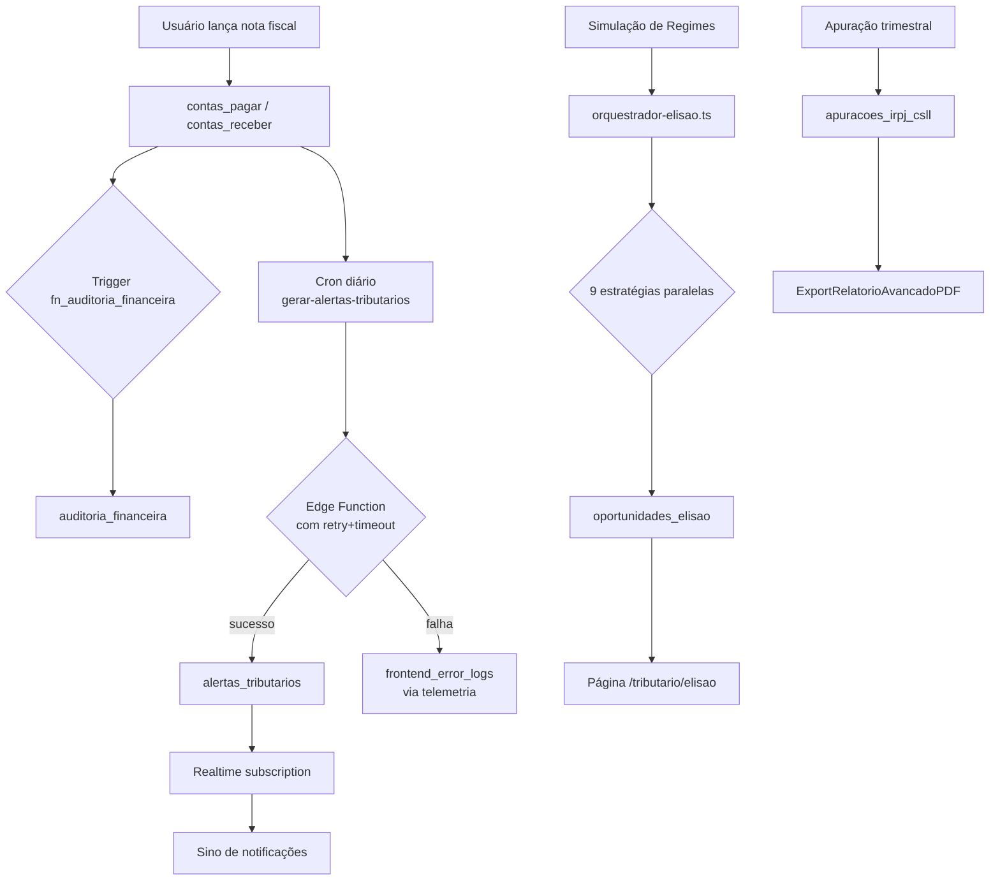

# Arquitetura — Promo Finance

## Stack
- **Frontend**: React 18 + Vite 5 + TypeScript + Tailwind + shadcn/ui
- **Backend**: Lovable Cloud (Supabase) — Postgres, Auth, Edge Functions, Realtime
- **Integrações**: Bling ERP v3, ASAAS, Bitrix24, Resend

## Fluxo Tributário ponta a ponta

## Camadas

### 1. Apresentação (`src/pages`, `src/components`)
- shadcn/ui + Tailwind com tokens semânticos HSL (ver `mem://design/unified-design-system-standards`).
- ErrorBoundary global captura crashes e reporta para telemetria.
- A11y: WCAG AA validado via axe-core em testes Vitest.

### 2. Lógica de domínio (`src/lib/tributario`, `src/lib/financeiro`)
- Funções puras testáveis (988+ testes Vitest).
- Orquestradores (ex: `orquestrador-elisao.ts`) coordenam múltiplas estratégias.

### 3. Acesso a dados (`src/services`)
- Sempre via `supabase` client tipado.
- Leituras de single record usam `.maybeSingle()` (`mem://backend/supabase-query-resilience`).
- Views otimizadas (`vw_contas_pagar_painel`, etc.) — `mem://performance/consumo-views-otimizadas`.

### 4. Backend (Postgres + Edge Functions)
- RLS hardenizada em todas as tabelas (`mem://security/rls-hardening-rules`).
- Funções security definer com `SET search_path = public` para evitar SQL injection.
- Edge Functions com structured logging JSON e retry exponencial.

## Observabilidade

| Sinal              | Origem                          | Consulta                                       |
|--------------------|---------------------------------|------------------------------------------------|
| Erros frontend     | `frontend_error_logs`           | RLS: user vê próprios; admin vê todos         |
| Auditoria CRUD     | `auditoria_financeira`          | Trigger automático em tabelas críticas        |
| Cron history       | `get_cron_run_history(job, n)`  | Admin only via RPC                             |
| Edge Fn logs       | Painel Lovable Cloud            | JSON estruturado: `{level, event, fn, ctx}`   |
| Auth               | `audit_logs`                    | `log_audit(action, table, record, ...)` RPC   |

## Segurança

- **RBAC 4 papéis**: admin, financeiro, operacional, visualizador (`mem://auth/rbac-4-role-system`).
- **HIBP** ativo em signup.
- **Account lockout exponencial** (1, 2, 4, 8, ... minutos até 24h).
- **IP/Geo restriction** opcional via `security_settings`.

## Decisões arquiteturais

- **Independent projects** (não monorepo) — `mem://architecture/independent-projects-strategy`.
- **Proxy externo** para `clientes`/`fornecedores` via Edge Function `external-data` — `mem://integrations/proxy-dados-supabase-externo`.
- **Lovable AI Gateway** para IA (sem API key custom) — usa `LOVABLE_API_KEY`.
