# Diagrama ER — núcleo financeiro

> Visão das relações do núcleo multi-empresa. Fonte: `supabase/migrations/`
> (200+ foreign keys apontam para `empresas` — é o hub do modelo).
> Mostra só as entidades centrais; tabelas de apoio/IA/tributário seguem o
> mesmo padrão `*_id → tabela(id)` + `empresa_id` obrigatório.

```mermaid
erDiagram
    empresas ||--o{ user_empresas : "membros"
    empresas ||--o{ contas_pagar : "tem"
    empresas ||--o{ contas_receber : "tem"
    empresas ||--o{ clientes : "tem"
    empresas ||--o{ fornecedores : "tem"
    empresas ||--o{ contas_bancarias : "tem"
    empresas ||--o{ centros_custo : "tem"
    empresas ||--o{ categorias : "tem"
    empresas ||--o{ asaas_payments : "tem"
    empresas ||--o{ asaas_customers : "tem"
    empresas ||--o{ asaas_transfers : "tem"
    empresas ||--o{ notas_fiscais : "tem"
    empresas ||--o{ sso_providers : "tem"

    user_empresas }o--|| auth_users : "user_id"

    clientes ||--o{ contas_receber : "recebe de"
    fornecedores ||--o{ contas_pagar : "paga a"
    categorias ||--o{ contas_pagar : "classifica"
    categorias ||--o{ contas_receber : "classifica"
    centros_custo ||--o{ contas_pagar : "rateia (ref. lógica)"
    centros_custo ||--o{ contas_receber : "rateia (ref. lógica)"
    centros_custo ||--o{ centros_custo : "hierarquia (parent_id)"
    contas_bancarias ||--o{ transacoes_bancarias : "movimenta"
    contas_bancarias ||--o{ contas_pagar : "conta de pagamento (ref. lógica)"
    contas_bancarias ||--o{ contas_receber : "conta de recebimento (ref. lógica)"


    clientes ||--o{ asaas_customers : "espelha no Asaas"
    contas_receber ||--o{ asaas_payments : "cobra via"
    asaas_customers ||--o{ asaas_payments : "paga (ref. externa asaas_customer_id, sem FK)"

    nfe_recebidas }o--o| contas_pagar : "vincula opcional (conta_pagar_id FK anulável)"
    %% notas_fiscais não tem FK para contas_pagar/nfe_recebidas — sua única
    %% relação persistida é empresa_id; associações de negócio são conceituais

    contas_receber ||--o{ conciliacoes_parciais : "baixa parcial"
    contas_pagar ||--o{ conciliacoes_parciais : "baixa parcial"
    transacoes_bancarias ||--o{ conciliacoes_parciais : "compõe baixa"

    sso_providers |o--o{ scim_tokens : "provisiona com (provider_id anulável — token pode nascer sem provedor e só é rejeitado ao criar grupo)"

    empresas {
        uuid id PK
        string cnpj
        string razao_social
        boolean ativo
    }
    user_empresas {
        uuid id PK
        uuid user_id FK
        uuid empresa_id FK
        string role "admin|financeiro|operacional|visualizador|contador (enum app_role)"
        boolean is_default
        string provisioned_via "manual|sso|scim (CHECK no banco)"
    }
    contas_pagar {
        uuid id PK
        uuid empresa_id FK
        uuid fornecedor_id FK "anulável"
        uuid categoria_id FK "anulável"
        uuid centro_custo_id "ref. lógica — SEM constraint FK"
        uuid conta_bancaria_id "ref. lógica — SEM constraint FK"
        numeric valor
        date data_vencimento
        date data_pagamento
        string status "escrita: pendente|pago|cancelado (interseção dos 2 CHECKs); leitura pode trazer legado: vencido|parcial|atrasado"
        timestamptz updated_at "lock otimista"
    }
    contas_receber {
        uuid id PK
        uuid empresa_id FK
        uuid cliente_id FK "anulável"
        uuid categoria_id FK "anulável"
        uuid centro_custo_id "ref. lógica — SEM constraint FK"
        uuid conta_bancaria_id "ref. lógica — SEM constraint FK"
        numeric valor
        date data_vencimento
        date data_recebimento
        string status "pendente|recebido|pago|vencido|cancelado|parcial|atrasado|em_acordo"
        string etapa_cobranca
        timestamptz updated_at "lock otimista"
    }
    transacoes_bancarias {
        uuid id PK
        uuid conta_bancaria_id FK
        date data
        numeric valor
        boolean conciliada
    }
    asaas_payments {
        uuid id PK
        uuid empresa_id FK
        string asaas_id
        string asaas_customer_id "id externo Asaas (TEXT, sem FK p/ asaas_customers)"
        uuid conta_receber_id FK
        numeric valor
        string status
    }
```

## Invariantes de modelo (o que o diagrama garante)

- **Tabelas de negócio são isoladas por empresa** — quase todas têm
  `empresa_id` direto e a RLS nega cross-empresa (ver
  `RLS_MATRIZ_NEGATIVA.md`); exceção documentada: `transacoes_bancarias`
  NÃO tem `empresa_id` — seu isolamento é indireto via
  `conta_bancaria_id` → `contas_bancarias.empresa_id`.
- **Baixa de conta é via `conciliacoes_parciais`** — join entre
  `transacoes_bancarias` e a conta (pagar/receber); conta paga/recebida sem
  transação conciliada é exceção manual, não o fluxo.
- **`contas_pagar.updated_at` / `contas_receber.updated_at`** são a versão do
  lock otimista — trigger `update_updated_at_column` os mantém.
- **Espelhos de provedor**: `asaas_*` guardam o id externo (`asaas_id`) +
  o vínculo interno (`conta_receber_id`) — reconciliação por webhook casa
  os dois; `bling_*` (`bling_sync_logs`, `bling_webhook_events`) registram
  só `modulo`/`resource_id`, sem vínculo direto com `contas_receber`.
- **`user_empresas` é a fronteira de autorização** — RLS e edge fns resolvem
  "usuário X pode acessar empresa Y" exclusivamente por ela.
