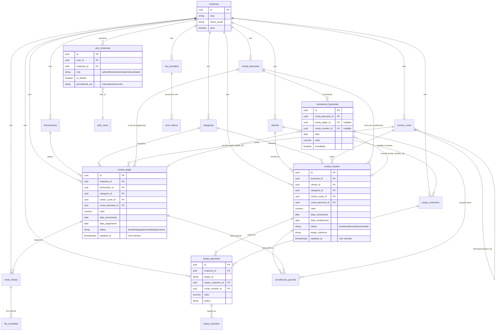

# Diagrama ER — núcleo financeiro

> Visão das relações do núcleo multi-empresa. Fonte: `supabase/migrations/`
> (200+ foreign keys apontam para `empresas` — é o hub do modelo).
> Mostra só as entidades centrais; tabelas de apoio/IA/tributário seguem o
> mesmo padrão `*_id → tabela(id)` + `empresa_id` obrigatório.

## Invariantes de modelo (o que o diagrama garante)

- **Toda tabela de negócio tem `empresa_id`** — isolamento multi-tenant; a RLS
  nega cross-empresa (ver `RLS_MATRIZ_NEGATIVA.md`).
- **Baixa de conta é sempre via `transacoes_bancarias`** — conta paga/recebida
  sem transação conciliada é exceção manual, não o fluxo.
- **`contas_pagar.updated_at` / `contas_receber.updated_at`** são a versão do
  lock otimista — trigger `update_updated_at_column` os mantém.
- **Espelhos de provedor** (`asaas_*`, `bling_*`) guardam o id externo
  (`asaas_id`) + o vínculo interno (`conta_receber_id`) — reconciliação por
  webhook casa os dois.
- **`user_empresas` é a fronteira de autorização** — RLS e edge fns resolvem
  "usuário X pode acessar empresa Y" exclusivamente por ela.
