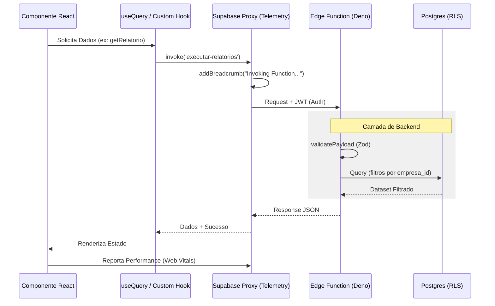

# Auditoria Técnica e Resiliência do Sistema

Este documento detalha as implementações realizadas para garantir a estabilidade, segurança e rastreabilidade da plataforma Promo Finance.

## 1. Ciclo de Vida de uma Requisição

A arquitetura utiliza um padrão de interceptação para garantir que cada interação seja registrada e validada antes de atingir o banco de dados.



## 2. Pilares de Estabilidade

### A. Observabilidade e Telemetria (`src/lib/telemetry.ts`)
Implementamos um sistema de captura de erros inspirado no Sentry.
- **`reportError` & `addBreadcrumb`**: Além de capturar a stack trace, o sistema mantém um histórico (breadcrumbs) das últimas 20 ações do usuário e chamadas de rede.
- **Supabase Proxy (`src/integrations/supabase/client.ts`)**: Um `Proxy` de JavaScript intercepta todas as chamadas ao SDK do Supabase, injetando automaticamente breadcrumbs sobre tabelas acessadas e functions invocadas.

### B. Idempotência de Webhooks (`supabase/functions/_shared/validation.ts`)
Para evitar processamento duplicado em integrações críticas (Asaas, Bling):
- **`isWebhookProcessed`**: Utilitário que verifica no banco se o ID único do evento já foi processado com sucesso.
- **Fail-Closed Strategy**: Rejeição automática de requisições se chaves de segurança estiverem ausentes.

### C. Permissões Multi-Empresa (`src/components/auth/`)
- **`EmpresaGuard`**: Middleware de interface que força a seleção de um contexto de empresa ativo antes de renderizar rotas protegidas.
- **Isolamento de Cache**: Mudanças de empresa disparam o evento `current-empresa-changed`, que invalida o cache do React Query para evitar vazamento de dados entre sessões.

## 3. Guia de Arquitetura para Desenvolvedores

### Mapa de Camadas

| Camada | Pasta | Responsabilidade |
| :--- | :--- | :--- |
| **View** | `src/pages/` | Definição de rotas e layout estrutural. |
| **Logic** | `src/hooks/` | Hooks reutilizáveis (React Query) e lógica de negócio. |
| **Security** | `src/components/auth/` | Guards e validação de contexto organizacional. |
| **Service** | `src/integrations/` | Cliente Supabase com telemetria injetada. |
| **Backend** | `supabase/functions/` | Serverless functions e orquestração de webhooks. |
| **Testing** | `e2e/` | Testes de regressão funcional e visual (Playwright). |

## 4. Contratos de Edge Functions

### `external-data`
Ponte segura para dados externos e integrações de terceiros.

**Requisição (Request):**
```json
{
  "action": "fetch_external_report",
  "empresa_id": "uuid",
  "params": { "provider": "asaas" }
}
```

**Erros Padronizados:**
- `400`: Payload inválido (violação de contrato Zod).
- `403`: Token de webhook inválido ou expirado.
- `503`: Configuração de ambiente incompleta (Fail-closed).

## 5. Saúde do Sistema (`/admin/system-health`)
A Edge Function `health` monitora:
- Conectividade com Postgres.
- Status do Realtime (Websockets).
- Latência de APIs de terceiros (Ping para Asaas/Bling).
